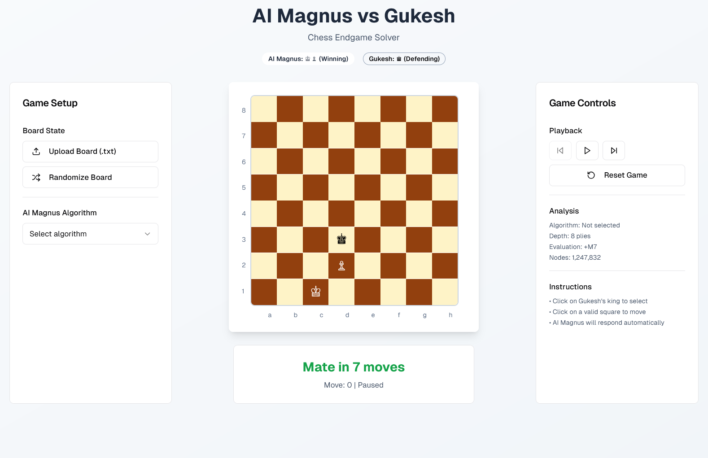

# AI Magnus vs Gukesh
> Task Seleksi Lab IRK created by Rafi

versi **26/07/2025** </br>
Revisi 1 - 26/07/2025: tambahan spek bonus (no. 8)

## 💡 Latar Belakang

<p align="justify">
Di tengah riuhnya final Kejuaraan Catur Dunia 2026, sebuah drama tak terduga terjadi. Sang legenda, Magnus Carlsen, yang diyakini semua orang telah kembali untuk merebut tahtanya, berhasil membawa juara bertahan, Gukesh Dommaraju, ke babak endgame yang krusial. Di atas papan, situasi terlihat menguntungkan bagi Magnus, ia memiliki Raja dan satu pion yang siap meluncur, sementara Gukesh hanya bertahan dengan Rajanya yang kesepian. Namun, penonton dan komentator tidak menyadari sebuah rahasia besar. Yang duduk di hadapan Gukesh bukanlah manusia, melainkan AI Magnus!, sebuah kecerdasan buatan yang dirancang untuk meniru gaya permainan sang maestro dengan sempurna.
</p>

<p align="center">
  
  <br>
  <i>Gambar 1. AI Magnus vs Gukesh</i>
</p>

<p align="justify">
Tepat di momen paling kritis inilah bencana terjadi. Sebuah anomali daya yang tak terduga menyebabkan sebagian besar sistem AI Magnus mengalami corrupt. Algoritma kompleksnya yang mampu memprediksi puluhan langkah ke depan dengan evaluasi rumit kini lumpuh total. Yang tersisa hanyalah sebuah modul failsafe darurat, sebuah implementasi dasar dari <strong>algoritma minimax dengan alpha-beta pruning</strong>. Dalam sekejap, AI Magnus yang superior berubah menjadi bot catur sederhana yang harus mengandalkan prinsip paling fundamental dalam teori permainan untuk bisa mengamankan kemenangan.
</p>

<p align="justify">
Kini, nasib AI Magnus dan reputasi Magnus bergantung sepenuhnya pada efektivitas algoritma minimax tersebut. Tanpa database endgame yang masif atau neural network yang canggih, bot ini harus secara sistematis mengevaluasi setiap kemungkinan langkah, memaksimalkan keuntungannya sendiri sambil meminimalkan peluang Gukesh. Mampukah algoritma klasik ini, menavigasi jebakan stalemate dan menemukan jalur kemenangan yang sempit di bawah tatapan jutaan pasang mata yang tidak menaruh curiga sama sekali? Inilah ujian sesungguhnya, bukan lagi pertarungan antara dua grandmaster, melainkan antara kecerdasan manusia melawan sebuah algoritma.
</p>

## 📝 Spesifikasi Tugas
<p align="justify">
Untuk menjamin kemenangan bagi AI Magnus, Anda ditugaskan untuk membuat solver <strong>King and Pawn Chess Endgame</strong> menggunakan algoritma <strong>minimax dengan alpha-beta pruning</strong>. Berikut merupakan detail dari program yang akan diimplementasi:
</p>


### 1. Aplikasi Berbasis Web

<p align="center">
  
  <br>
  <i>Gambar 2. Contoh Tampilan Web</i>
</p>

<p align="justify">
Buatlah sebuah aplikasi web (gambar hanya contoh/referensi) menggunakan bahasa dan arsitektur apapun sebagai user interface dari permainan AI Magnus vs Gukesh dengan spesifikasi sebagai berikut:
</p>

1) Display papan catur 8x8 beserta *files* dan *ranks* nya. Dengan A1 square di bagian kiri bawah.
2) Tombol **upload board (.txt)**
3) Tombol **randomize board**
4) Tombol **select algorithm**
5) Tombol **game playback controls**
6) Tombol **reset**
7) Info analisis (kreativitas)
8) Info mate in x moves
9) Play as Gukesh (black king interaktif), Anda bisa menggerakkan Black King untuk menghindar dari serangan AI Magnus.

### 2. Algoritma AI Magnus

<p align="justify">
Implementasikan algoritma untuk AI Magnus (white piece) dengan spesifikasi sebagai berikut:
</p>

1) Algoritma minimax dengan alpha-beta pruning
2) Algoritma alternatif 1 **[SPESIFIKASI BONUS]**
3) Algoritma alternatif 2 **[SPESIFIKASI BONUS]**

### 3. Aturan Permainan & Catur 

1) AI Magnus (white piece) memiliki sebuah pion dan raja.
2) Gukesh (black piece) hanya memiliki raja.
3) Pion otomatis dipromosi menjadi ratu.
4) **Black to move**
5) Seluruh peraturan catur seperti fifty move rule berlaku sesuai ketentuan FIDE.

### 4. Contoh Input

#### Format file
```txt
<white king>
<white pawn>
<black king>
```

#### 1. input1.txt
```txt
d4
d5
d6
```

#### 2. input2.txt
```txt
d4
d5
e5
```


---

## 📌 Penilaian

| No. | Item                     | Poin Maximum |
| :-- | :----------------------- | :----------- |
|     | **Spesifikasi Wajib**    |              |
| 1   | Algoritma minimax        | 700          |
| 2   | Input papan              | 40           |
| 3   | Play as Gukesh           | 200          |
| 4   | Display papan catur      | 50           |
| 5   | Info analisis & mate in X moves          | 50           |
| 6   | Validasi input/moves     | 50           |
| 7   | Laporan sederhana pada readme, minimal mengenai penjelasan algoritma (kaitkan dengan implementasi kode), serta fitur apa saja yang diimplementasikan | 150 |
|     | **Spesifikasi Bonus**    |              |
| 1   | Algoritma alternatif 1   | 350          |
| 2   | Algoritma alternatif 2   | 350          |
| 3   | Playback control         | 150          |
| 4   | Deployment               | 100          |
| 5   | Bisa memilih piece promosi | 300        |
| 6   | Kreativitas lainnya      | ???          |
| 7   | Perkenalan di grup line seleksi dengan menyertakan zodiak   |     10         |
| 8   | Menjawab salam/selamat pagi | 10 |
|     | **Demo**                 |              |
| 1   | Demo sinkronus (zoom/gmeet), asisten bisa meminta demo asinkronus (video) jika waktu tidak memungkinkan | 300 |
|     | **Total**                | **2800+**    |

---

## ❓QnA

<p align="justify">
Tidak ada QnA, jika ada spesifikasi yang dirasa kurang jelas silakan tulis asumsi saja pada README.
Mungkin terjadi revisi saat proses pengerjaan, cek spesifikasi secara berkala.
</p>

---

## 📂 Pengerjaan dan Pengumpulan

- Kumpulkan sesuai instruksi pada web seleksi.
- Chat line:**rafimaliki28** setelah mengumpulkan untuk konfirmasi jadwal demo.
- Tambahkan akses github:**rafimaliki28@gmail.com** ke repository saat konfirmasi jadwal demo.

---

## Referensi

* Gambar 1 & Gambar 2 AI generated
* https://en.wikipedia.org/wiki/Minimax
